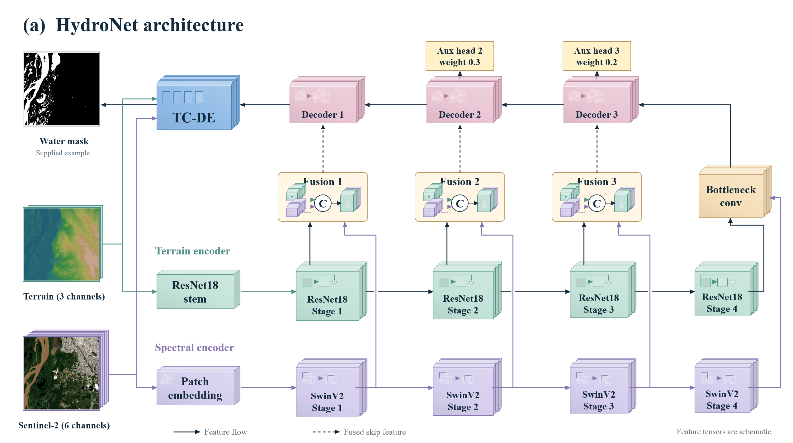
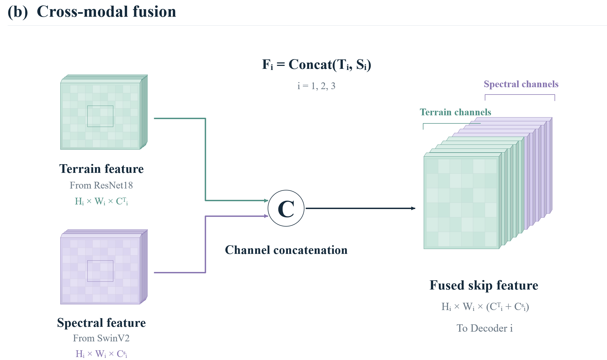
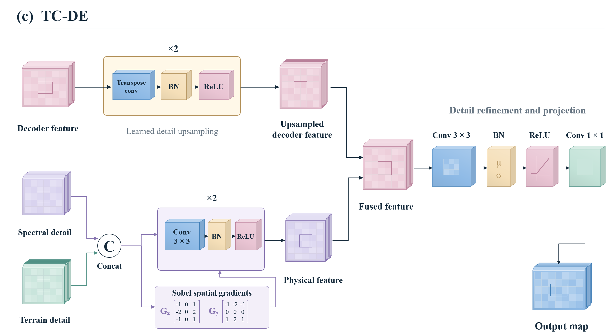
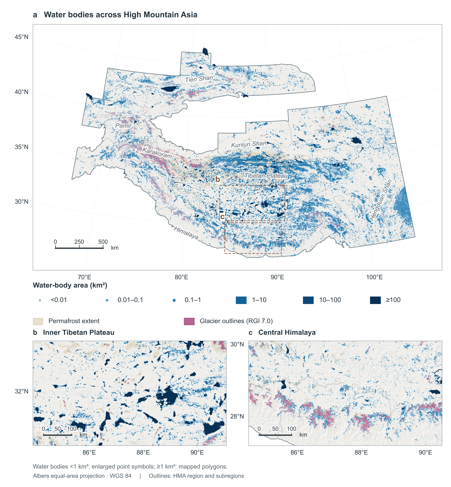

# HydroNet
This study proposes **HydroNet**, a high-precision hydrological semantic segmentation model featuring an encoder-decoder architecture.

  

  <em>Figure 1: HydroNet Architecture</em>

 

We adopted a **heterogeneous dual-branch encoding** strategy, with the network processing surface reflectance data and topographic data in parallel.

Simple yet robust concatenation-fusion blocks are used in the first three stages of the encoder, and skip connections are employed to feed into the decoder module, ensuring robust and efficient transmission of feature information.

  

  <em>Figure 2: ConcatFusion Block</em>

At the network’s endpoints, we built a Topological Continuity Detail Enhancement Block **(TC-DE)** .the introduction of 9-channel native inputs and explicit computations using the Sobolev operator—by constructing “physical barriers” on both sides of narrow waterways—enables the preservation of topological connectivity and the sharp reconstruction of shorelines in narrow water networks with extremely low computational overhead.

    

  <em>Figure 3: TC-DE</em>

# HMA_Water10
**10-Meter-Resolution Lake Mapping in Asia's High-Mountain Regions**

    

